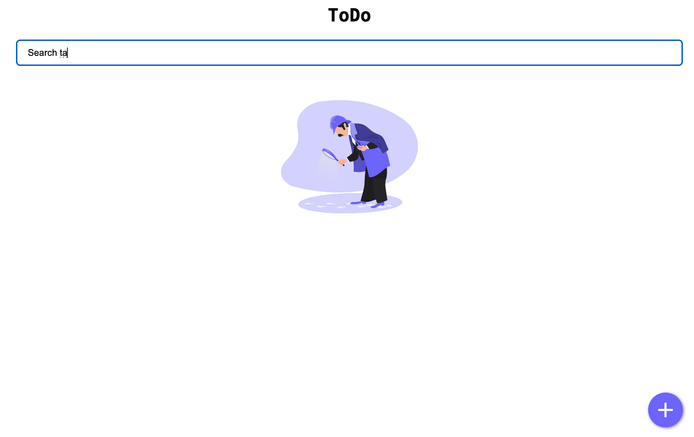
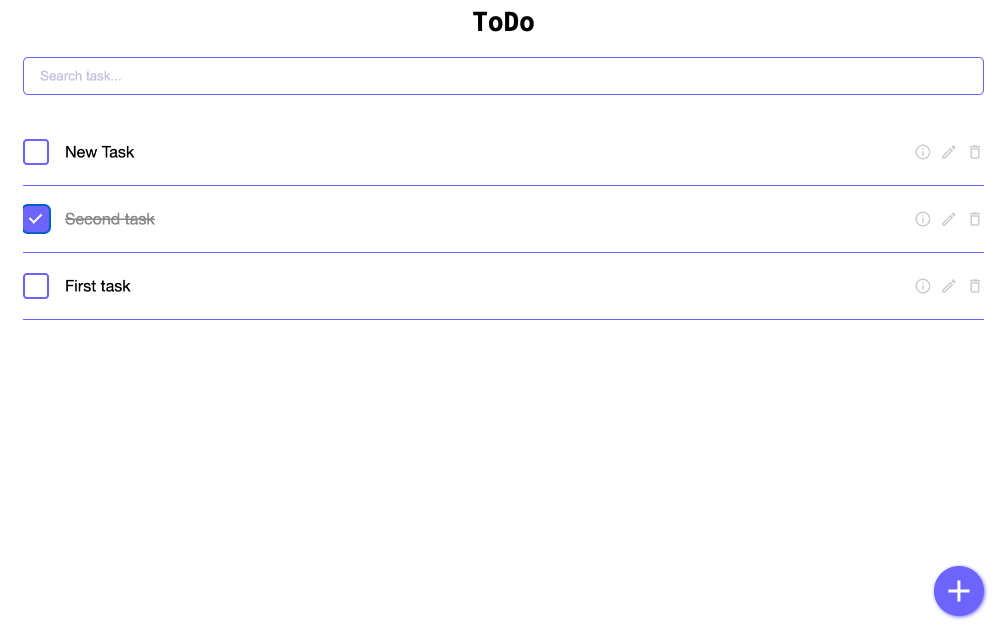

## To-Do List Project 📝

### Screenshots

<p>
  
  &nbsp; &nbsp; &nbsp; &nbsp; 
  
</p>

This is a **standard to-do list application** designed to help you organize and track your tasks efficiently.

***

## ✨ Features

* **Task Management:** Add, edit, delete, and mark tasks as complete.
* **Task Search:** Quickly find specific tasks using the integrated search function.
* **Persistent Storage:** Tasks are saved locally (localStorage).
* **Fully Responsive Design:** The interface adapts seamlessly to any screen size, from large desktop monitors to tablets and mobile phones.

***

## 🚀 Getting Started

To run this project locally, you must have **Node.js** version 20 or higher.

### Local Installation and Execution

Follow these steps to set up and run the project on your local machine:

1.  **Clone the repository** (if you haven't already):
    ```bash
    git clone [YOUR-REPOSITORY-URL]
    cd [your-project-directory]
    ```
2.  **Install dependencies**:
    ```bash
    npm ci
    ```
3.  **Start the application**:
    ```bash
    npm run start
    ```
The application should now be running, typically accessible at `http://localhost:3000`